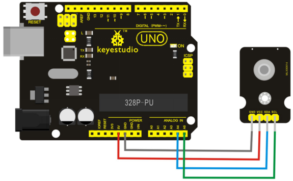
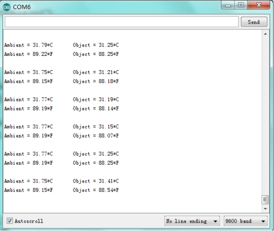
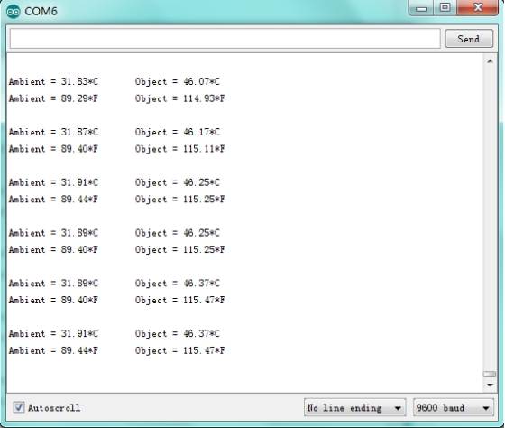

# KS0276 keyestudio MLX90614 Non-contact Infrared Temperature Sensor


## 1. Introduction

Keyestudio MLX90614 non-contact infrared temperature sensor is mainly composed of sensor MLX90614.

MLX90614 is an infrared non-contact thermometer, and the TO-39 package integrates infrared induction thermoelectric pile detector chip (MLX81101) and signal processing dedicated integrated chip MLX90302.

Due to the integration of low noise amplifier, 17-bit analog digital converter and DSP processing unit, the sensor achieves high precision and high resolution measurement.

## 2. Specification

- Working voltage：3.3-5V
- Communication way：IIC communication
- Working temperature range：from -40 to +125℃
- Measurement accuracy：±0.5℃（0 to 50℃）

## 3. Connection Diagram



## 4. Sample Code

Download Resources:  [Resource](./Resource.7z)

```c
<pre>
#include <Wire.h>
#include <Adafruit_MLX90614.h>

Adafruit_MLX90614 mlx = Adafruit_MLX90614();

void setup() 
{
  Serial.begin(9600);
  Serial.println("Adafruit MLX90614 test");  
  mlx.begin();  
}

void loop() 
{
  Serial.print("Ambient = "); Serial.print(mlx.readAmbientTempC()); 
  Serial.print("*C\tObject = "); Serial.print(mlx.readObjectTempC());           	     Serial.println("*C");
  Serial.print("Ambient = "); Serial.print(mlx.readAmbientTempF()); 
  Serial.print("*F\tObject = "); Serial.print(mlx.readObjectTempF());                   Serial.println("*F");
  Serial.println();
  delay(500);
}
```

## 5. Test Reult

Done as the above wiring, program the code, and then open the serial port monitor, the current temperature is shown in figure 1; if a heat source closes to the sensor, it can detect the temperature changes as shown in figure 2.

**Figure 1:**



**Figure 2:**

